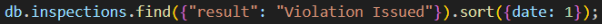

*Igor Ulyanov Melnic -1667150* 

*Julen Cruz Gómez - 1667663*

**Práctica 1**

**1. Diseño del esquema de la base de datos** 

- **Analizar la estructura de los datos y determinar el tipo de relación entre restaurantes e inspecciones (One-to-Few, One-to-Many, One-to-Millions)**

  Para analizar la estructura de datos que encontramos, hemos realizado una agregacion de dos fases. En la fase de $group sobre el campo ‘restaurant\_id’ en la colección de “inspections” en la que agregamos un campo count para saber cuantas inspecciones referencian el mismo restaurante. A continuacion hemos hecho una fase de $sort para ver los restaurantes con mas inspecciones.

  

  Hemos visto que como máximo, un restaurante tiene 3 inspecciones, por lo que el tipo de relación entre las dos colecciones es One-To-Few.

  

- **Justificar la elección de referencias (restaurant\_id) en lugar de documentos embebidos. También puedes decidir crear una nueva colección que no utilice las referencias e incorpore los documentos embebidos. Justifica la decisión.** 

  Existen múltiples razones por las que almacenar los datos de manera referenciada en dos colecciones diferentes puede ser beneficioso. Por ejemplo:

- Seguridad: Se pueden dar permisos de acceso diferentes a cada documento, permitiendo, por ejemplo, que los clientes accedan a los datos de los restaurantes y los propietarios a las inspecciones.
- Previsión: Si se anticipa que la cantidad de inspecciones por restaurante va a aumentar de manera significativa, tiene más sentido separar con antelación las colecciones.
- Consultas más eficaces:  Si se consultarán más las inspecciones que los datos de los restaurantes, tiene sentido separarlo en otra colección para no sobrecargar el sistema.

- **Definir un esquema de validación para ambas colecciones.**

  Hemos decidido que los datos críticos para un restaurante son: la dirección (tanto calle y número como población), el nombre del negocio y el código postal. Este último debe de ser un código alfanumérico de 3 caracteres. El razonamiento es que si es un negocio con un local físico que requiere inspección, estos datos deben existir.

Para las revisiones hemos considerado estos campos críticos: el id del certificado, el número del certificado, la fecha de la inspección, la id del restaurante asociado y el resultado de la inspección. Este último tiene un número definido de valores que puede tomar, por eso decidimos validarlos. Los otros campos hemos considerado críticos para la localización de cada inspección individual.

**2. Implementación de consultas en MongoDB**

- **Buscar en todos los restaurantes un tipo de comida específico (ej. "Chinese").**

  Consulta:

  

  Resultado:

  

- **Listar las inspecciones con violaciones, ordenadas por fecha.**

  Consulta:

  

  Resultado:

  

- **Encontrar restaurantes con una calificación superior a 4.**

  Consulta:

  

  Resultado:
**

**3. Uso de agregaciones**

- **Agrupar restaurantes por tipo de comida y calcular la calificación promedio.**

  Consulta:

  

Esta consulta la hemos resuelto con un agregate. Primero es necesario agrupar las informaciones de los restaurantes por su tipo de comida, y en esa misma fase, calcular su rating promedio con $avg. Finalmente realizamos un sort para ver los tipos de comida con el mejor rating.

Resultado:

- **Contar el número de inspecciones por resultado y mostrar los porcentajes.** 

  Consulta: 

  

  Esta consulta requiere de un aggregate, en nuestro caso. Las fases son las siguientes:

- $group (1º): se agrupa todos las inspecciones por su resultado y se hace un recuento de estos grupos, guardando sus cantidades en un nuevo atributo “count”
- $group (2º): Se agrupa todo en un solo documento donde se guarda el total de documentos individuales (suma de los count) y por otro lado un array con los recuentos individuales de cada posible resultado de la inspección. Se utiliza $push para añadir nuevos elementos al array, ya que sin ello solo se guardería la información del último
- $unwind: Crea un documento para cada elemento del array, conservando todos los campos del doc original y además un campo nuevo “results” que contiene un array de los atributos del elemento del array original que le corresponde
- $project: Al enseñar el resultado final, no nos interesa enseñar el \_id, pero si se enseña el tipo de resultado de la inspección y la cantidad de estos resultados. Por último se enseña también un campo “porcentaje” que guarda el resultado del cálculo del porcentaje. Debido a que “count” y “result” están dentro del campo “results” se debe acceder como un “array” pero “total” es un campo por separado y se accede simplemente.

Resultado:

- **Unir restaurantes con sus inspecciones utilizando $lookup.** 

  Consulta:

  

  ` `Este lookup junta a los restaurantes con sus debidas inspecciones, lo hace segun el campo “*id” del restaurante y el campo “*restaurant\_id” de la inspeccion. El problema surge de que los dos campos mencionados anteriormente no siguen el mismo formato y, por lo tanto, primero se debe pasar el campo “\_id” del restaurante a un String para poder compararlo de manera correcta

Resultado:

**Tareas Avanzadas**

**1. Optimización del rendimiento** 

- **Identificar las posibles consultas más frecuentes.** 

  En el caso de que la colección “restaurants” sea en la que los potenciales clientes de un restaurante busquen las opciones que tienen para ir a comer, hemos supuesto que las consultas más frecuentes se harán por tipo de comida. Para agilizar estas consultas añadiremos un índice para este campo.

  Además, es frecuente que potenciales clientes quieran filtrar y/o ordenar por el rating de los restaurantes para escoger la mejor opción. Un índice en este campo tambien ayudaria con la eficiencia de este tipo de consultas

  En cuanto a la colección de “inspections” hemos considerado que lo más razonable es que si un funcionario desea encontrar una inspección concreta, buscará por el nombre del local y la fecha de la inspección. Sería razonable entonces añadir un índice para estos dos campos como mínimo. Deberá ser combinado ya que esto permite optimizar la búsqueda conjunta por estos campos.

  Por otro lado también hemos considerado que se puede dar la ocasión de que alguien quiera buscar una inspección por su número concreto, pero creemos que este caso no se daría de manera suficientemente frecuente como para considerar una degradación en el tiempo de inserción al generar un índice para este nuevo campo.

- **Implementar índices adecuados para esas consultas.** 

  

- **Comparar el rendimiento antes y después de crear los índices utilizando explain().** 

  ||Rendimiento antes del índice|Rendimiento después del índice|
  | :-: | :- | :- |
  |

Búsqueda por tipo de gastronomía
|||
  |
Antes del índice se exploraban 2,648 documentos para encontrar 174 coincidencias.

Después del índice solamente se exploraron los 174 documentos relevantes, es decir, hemos evitado revisar 2,474 documentos.
|||
  |

Ordenar por valoración
|||
  |
Antes del índice se revisaban 2,648 documentos y se encontraban 2,228.

Después del índice olo se examinaron los 2,228 documentos relevantes.

Sin embargo, la consulta tardó 2 ms más después de aplicar el índice. Esto puede explicarse porque los documentos resultantes representan más del 80% del total de la colección. En estos casos, el tiempo extra en consultar el índice y luego recuperar los documentos puede no compensar su uso.
|||
  |

Busqueda de inspección por fecha y nombre del restaurante
|||
  |
Antes del índice se revisaron 6,370 documentos para encontrar 1 resultado, tardando 0 ms.

Después del índice solo hizo falta revisar 1 documento de 1 posible, manteniendo a 0 ms el tiempo de consulta. Aunque el tiempo sigue siendo 0 ms, probablemente la consulta sea aún más rápida, pero MongoDB Compass no muestra suficientes decimales para reflejarlo.
|||

**2. Estrategias de escalabilidad** 

- **Proponer una estrategia de sharding adecuada para este dataset.** 

  En nuestro caso hipotético, consideramos que en la colección de restaurantes principalmente se harán consultas por el tipo de gastronomía. Consideramos que compartir por el tipo de comida que ofrece el restaurante es lo más eficaz. Además, ya tenemos un índice en este campo. Si se hubiese escogido un campo sin índice, se hubiera creado otro nuevo, esto provocaría un bajón de rendimiento en las escrituras. Con este tipo de sharding, podremos recuperar todos los restaurantes del mismo tipo de comida del mismo shard.

  Igualmente en el caso de la colección de inspecciones hemos hecho un índice compuesto de lo que consideramos que mejorará las búsquedas lo máximo posible. Utilizaremos estos mismos campos (nombre del negocio y fecha) para el shard key. Esto hará que toda la información de las inspecciones relacionadas con el mismo restaurante acabe en el mismo shard.

  Por lo tanto, nuestro dataset se verá fragmentado en 2 shards, un nodo mongos y un nodo de configuración.

- **Diseñar un esquema de replicación para alta disponibilidad.** 

  Para garantizar una alta disponibilidad y tolerancia a fallos, se implementará un esquema de Replica Set en cada shard. Cada Replica Set constará de tres nodos: un nodo primario, que gestionará tanto las operaciones de lectura como de escritura, y dos nodos secundarios, que estarán destinados exclusivamente a lecturas.

Los nodos de cada Replica Set estarán distribuidos geográficamente en diferentes centros de datos, lo que contribuye significativamente a mejorar la disponibilidad del sistema. Esta distribución geográfica no solo permite una alta resiliencia frente a fallos de hardware o problemas de servidor en un solo centro de datos, sino que también optimiza la recuperación ante desastres, garantizando que el sistema siga funcionando de manera continua incluso si uno de los centros de datos se ve afectado por interrupciones de red, apagones o fallos de infraestructura.

- **Analizar posibles cuellos de botella y soluciones.** 

  **1. Cuello de Botella en la Red**

  Dado que MongoDB es una base de datos distribuida y cada shard y Replica Set se comunican entre sí a través de la red, la latencia y el ancho de banda limitado  puede convertirse en un cuello de botella. Si la red no es lo suficientemente rápida o estable, las operaciones de lectura y escritura pueden volverse lentas, afectando el rendimiento.

  Una posible solución podría ser 

- Utilizar redes de alta velocidad
- Asegurarnos de que los centros de datos estén lo más cerca posible entre sí para reducir la latencia.

**2. Cuello de botella en la gestión de la escritura** 

El nodo primario de cada shard es el único capaz de manejar las operaciones de escritura. Si el volumen de escrituras es muy alto, el nodo primario puede convertirse en un cuello de botella, ya que se genera una cola de escrituras que después deben ser replicadas a los nodos secundarios, lo cual consume recursos.

Para solucionar este posible cuello de botella, podríamos intentar:

- Balancear la carga de escrituras
- Propagar los cambios a los nodos secundarios en “batches”. No intentar propagar las escrituras en el momento de su realización. Esto podría perjudicar la consistencia.
- Optimizar índices para reducir el tiempo necesario para escribir.

**3. Cuello de Botella en el Sharding (Distribución de Datos)**

El sharding en MongoDB puede provocar un cuello de botella si la distribución de los datos no es uniforme, algunos shards pueden recibir más carga de la que pueden manejar, mientras que otros pueden estar subutilizados.

Posibles soluciones a implementar:

- Seleccionar una clave de sharding adecuada para distribuir mejor los datos entre shards.
- Configurar MongoDB para realizar un rebalanceo automático de los shards.

